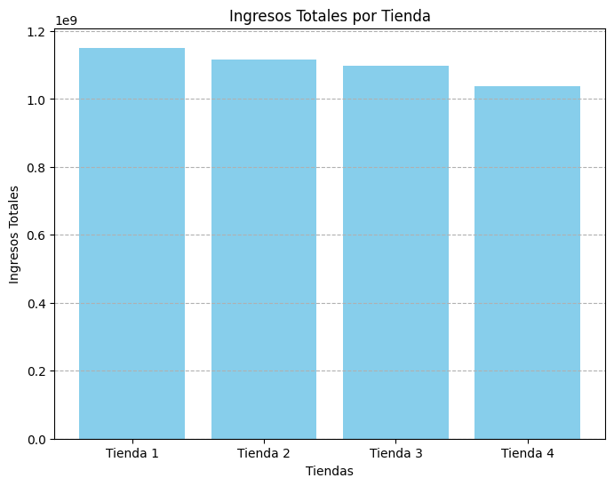

# 🛍️ Análisis de Tiendas - Alura Store

Este proyecto tiene como objetivo analizar los datos de ventas de cuatro tiendas de la cadena **Alura Store** para ayudar al Sr. Juan a tomar una decisión estratégica: **¿Qué tienda debe vender para financiar su nuevo emprendimiento?**

---

## 🎯 Objetivo del Análisis

A través de un estudio exploratorio y visual del conjunto de datos de ventas, se busca:

- Evaluar el rendimiento económico de cada tienda (ingresos totales).
- Analizar la satisfacción del cliente mediante calificaciones promedio.
- Identificar categorías y productos más y menos vendidos.
- Comparar los costos promedio de envío entre tiendas.
- Determinar qué tienda presenta menor eficiencia para ser recomendada para venta.

---

## 📁 Estructura del Proyecto

📦 AluraStore/
├── AluraStoreLatam.ipynb # Notebook principal con todo el análisis
├── README.md # Este archivo
├── /img # Carpeta opcional para gráficos exportados
└── requirements.txt # (opcional) Dependencias del proyecto

---

## 📊 Ejemplos de Visualizaciones

### Ingresos por Tienda
Comparación de ingresos totales entre las cuatro tiendas.



---

### Dispersión: Calificación vs Ingresos


> 📌 Insight: Tiendas con mejores calificaciones tienden a tener mayores ingresos.

---

### Gráfico Circular: Top Productos por Tienda

Se analiza si la tienda depende excesivamente de uno o dos productos para sostener sus ingresos.


> 📌 Insight: La tienda 4 depende altamente de un solo tipo de producto, lo cual es un riesgo comercial.

---

## ⚙️ Cómo ejecutar el notebook

### 🔧 Requisitos

- Python 3.8 o superior
- Jupyter Notebook o Google Colab
- Librerías necesarias:
  - `pandas`
  - `matplotlib`
  - `seaborn`

Puedes instalar las dependencias con:

```bash
pip install pandas matplotlib seaborn
